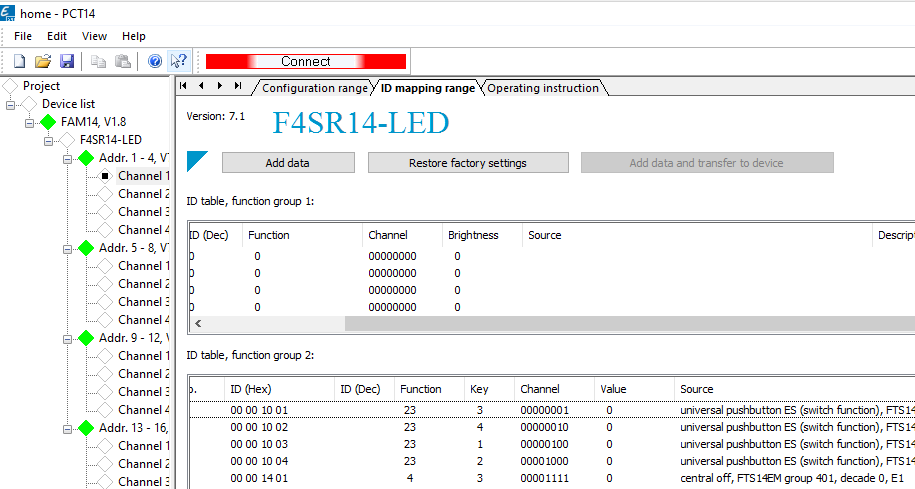

[Back](README.md)

# PCT14 into json
Below a screen-shot of PCT14
- The device address can be found in column left: **Device list**
  and need to be converted to Hex
    - Addr 1 channel 1 becomses: `00000001`
    - Addr 1 channel 2 becomses: `00000002`
    - Addr 13 channel 3 becomses: `0000000F`
- From the ID table function group 2 we found
    - The btn.addr in the column **ID(Hex)**
    - The btn.data is related to the column **Key** for
        - Key 1: btn.data becomes: `30000000`
        - Key 2: btn.data becomes: `10000000`
        - Key 3: btn.data becomes: `70000000`
        - Key 4: btn.data becomes: `50000000`



So for the first 5 entries below this becomes

`el-tako_home.json`
```
{
    "all_off": {
        "typ": "button", 
        "group": "Central", "name": "Central Off",
        "btn": {"addr": "00001401", "data": "70000000"}
    },
    "00000001": {
        "typ": "FSR14", 
        "group": "Living", "name": "LED1",
        "btn": {"addr": "00001001", "data": "70000000"}
    },
    "00000002": {
        "typ": "FSR14", 
        "group": "Living", "name": "LED2",
        "btn": {"addr": "00001002", "data": "50000000"}
    },
    "00000003": {
        "typ": "FSR14", 
        "group": "Living", "name": "LED3",
        "btn": {"addr": "00001003", "data": "30000000"}
    },
    "00000004": {
        "typ": "FSR14", 
        "group": "Living", "name": "LED4",
        "btn": {"addr": "00001004", "data": "10000000"}
    }
}
```

