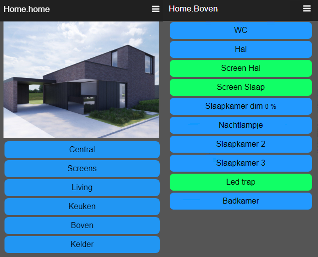
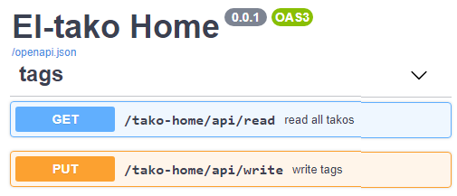

# El-tako simple home automation

This is a simple home automation using [Eltako funk Series 14](https://www.eltako.com/en/product-category/professional-smart-home-en/series-14-rs485-bus-rail-mounted-devices-for-the-centralised-wireless-building-installation/)

It simulates a button-press (previous learned by the devices) 
and reads the device status from the Eltako-bus.

Tested with:

| Device   |                  |
| -------- | ---------------- |
| FAM14    | Antenna module   |
| FTS14EM  | Inputs - buttons |
| FSR14-4x | Impulse relais   |
| FSB14    | Roller shutter   |
| FUD14    | Dimmer           |
| Enocean  | Wireless button  |


http://127.0.0.1:8088



## Configuration

### Web service
[bin/el-tako_home.ini](bin/el-tako_home.ini)
```
{   "HTTP_PORT": 8088,
    "STATIC_DIR": "../www",
    "API_BASE": "/tako-home/api",
    "COM_PORT": "COM7:57600,n,8,1"  # serial USB port where FAM14 is connected
}
```


### el-tako_home.ini

First you need to program your Eltako devices with addresses and learn the actions on buttons.  
Use the [Eltako tool PCT14](https://www.eltako.com/en/software/software-gfvs-pct14.html) to do this.

Every device has an address which is the key in the json below.  
Set the `typ`e of the device, the `group` and `name` you want to appear in the App.  
The `all_off` is not a device it only simulates a button press.  
The `btn` specifies the button address and data to be send on the Eltako func RS485 bus.  
To find the correct btn.addr and .data use PCT14.

`el-tako_home.json`
```
{
    "all_off": {
        "typ": "button", 
        "group": "Central", "name": "Alles uit",
        "btn": {"addr": "00001028", "data": "10000000"}
    },
    "00000004": {
        "typ": "FSB14", 
        "group": "Screens", "name": "Screen Keuken",
        "btn": {"addr": "FEF82C30", "data": "10000000"}
    },
    "00000008": {
        "typ": "FUD14", 
        "group": "Living", "name": "Zithoek dim",
        "btn": {"addr": "00001036", "data": "50000000"}
    },
    "0000000a": {
        "typ": "FUD14",
        "group": "Keuken", "name": "Keuken dim",
        "btn": {"addr": "00001003", "data": "30000000"}
    },
    "0000000c": {
        "typ": "FSR14",
        "group": "Keuken", "name": "Eettafel",
        "btn": {"addr": "00001026", "data": "30000000"}
    }
    "00000013": {
        "typ": "FSR14", 
        "group": "Living", "name": "Bureau",
        "btn": {"addr": "00001006", "data": "30000000"}
    }
}
```
### Install
- Connect the FAM14 USB (virtual serial port)
    - turn the FAM14 wheel BA to Pos. 4
- Copy the directories `bin` and `www`
- set the correct COM port in `bin/el-tako_home.ini`
- create your `bin/el-tako_home.ini`
- Create a virtual env (or use pyinstaller)
    - `pip install -r requirements.txt`
    - `python el-tako_home.py`
- http://127.0.0.1:8088


## TODO
- security
- [connect with Google Home Assitant](https://developers.google.com/assistant/smarthome/overview#how_to_build)

## Refs:

- [Eltako installation manual](https://www.eltako.com/fileadmin/downloads/en/_bedienung/Series_14_RS485_Bus_DIN_Rail_Mounted_DevicesSeries_gb.pdf)
- [Eltako wireless telegrams](https://www.eltako.com/fileadmin/downloads/en/_main_catalogue/Gesamt-Katalog_ChT_gb_highRes.pdf)
- [Eltako PCT14](https://www.eltako.com/en/software-pct14/)
- [FastAPI](https://fastapi.tiangolo.com/)
